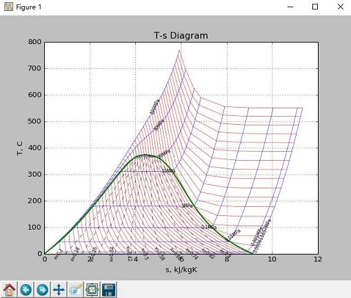
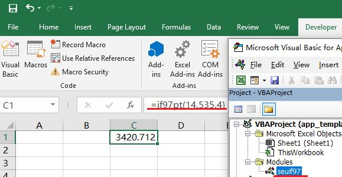

# SEUIF97

[](https://zenodo.org/badge/latestdoi/110833324)

SEUIF97 is the high-speed shared library of IAPWS-IF97. It is suitable for computation-intensive calculations，such as heat cycle calculations, simulations of non-stationary processes, real-time process monitoring and optimizations.   
 
Through the high-speed library, the results of the IAPWS-IF97 are accurately produced at about 3x speed-up compared to the repeated squaring method for fast computation of integer powers, 10x speed-up compared to  the `math.pow()` of the C standard library.   

[The shared  libraries](./SharedLibrary/) for Windows and Linux(X86/X64):

* Windows32/64: `libseuif97.dll`; Linux64: `libseuif97.so`

[The binding APIs](./api/) for the programming languages:

* Python, C/C++, Excel VBA, MATLAB, Fortran, Java, C#, Modelica, Rust, Pascal

**Publications:**

* 王培红,贾俊颖,程懋华. 水和水蒸汽热力性质IAPWS-IF97公式的通用计算模型[J]. 动力工程,2001,21(6)：1564-1567 [[ pdf ]](./doc/水和水蒸汽热力性质IAPWS-IF97公式的通用计算模型.pdf)

* 芮嘉敏,孙振业,程懋华. 基于最短加法链状态空间树的IAPWS-IF97快速计算方法[J]. 汽轮机技术,2017,59(4):245-247 [[ pdf ]](./doc/基于最短加法链状态空间树的IAPWS-IF97快速计算方法.pdf)
 
## Functions of the SEUIF97 Shared Library

Functions of water and steam properties, exergy analysis and the thermodynamic process of steam turbine are provided in **SEUIF97**

### Functions of Water and Steam Properties

Using SEUIF97, you can set the state of steam using various pairs of know properties to get any output properties you wish to know, including in the [30 properties in libseuif97](#properties-in-libseuif97).

The following input pairs are implemented: 

```
(p,t) (p,h) (p,s) (p,v) (p,x) 

(t,h) (t,s) (t,v) (t,x) 

(h,s)  
```

### Functions of Thermodynamic Process of Steam Turbine
   
*  1 Isentropic Enthalpy Drop：ishd(pi,ti,pe)

       pi - double,  inlet pressure(MPa); ti - double, inlet temperature(°C)
       pe - double, outlet pressure(MPa)

* 2 Isentropic Efficiency(0~100)： ief(pi,ti,pe,te) (superheated steam zone)

       pi - double,  inlet pressure(MPa); ti - double,  inlet temperature(°C)
       pe - double, outlet pressure(MPa); te - double, outlet temperature(°C)

## [API](./api)

* Python: [seuif97.py](./api/seuif97.py) 

* C/C++:  [seuif97.h](./api/seuif97.h) 

* Excel VBA: [seuif97.bas](./demo/ExcelVBA/seuif97.bas)

* MATLAB: [seuif97.m](./demo/MATLAB64/seuif97/seuif97.m)

* Java: [seuif97.java](./api/seuif97.java)  

* Fortran: [seuif97.f08](./api/seuif97.f08)  

* C#: [seuif97.cs](./api/seuif97.cs) 

* Modelica: [seuif97.mo](./api/seuif97.mo) 
 
* Rust: [seuif97.rs](./api/seuif97.rs) 

* Pascal: [seuif97.pas](./api/seuif97.pas) 

## Install SEUIF97 Library Manually

Download **SEUIF97.zip** of the repository，then unzip and install the shared library and APIs for different programming languages manually.

Call the shared library from one programming language, you may

1. Put the shared library in the Lib path of OS or the programming language

2. Add the API file of the programming language to its API path

### Put the shared library in the Lib path of OS

##### Windows32/64 
  
copy `libseuif97.dll` in the [Windows64](./SharedLibrary/Windows64) or [Windows32](./SharedLibrary/Windows32) folder to a default path of Windows32/64's DLL
      
       C:\Windows\system
   
##### Linux64 
    
copy `libseuif97.so` in the [Linux64](./SharedLibrary/Linux64) folder to a default path of Linux shared lib

```bash
$sudo cp libseuif97.so /usr/lib/
```
### Put the API file to the API path of programming languages

The API paths of different programming languages are also different.  

Please refer to the instructions of different programming languages

## [SEUIF97 for Python](./demo/demo-python)

### Install from PyPI

* [seuif97 on PyPI](https://pypi.org/project/seuif97/)

Windows64/32
```
>python -m pip install seuif97
```
Linux64
```
$sudo -H python3 -m pip install seuif97
```
### Install manually

Put the shared library in the default path of OS's Lib as the instructions above.

Then,copy **seuif97.py** in the [api](./api) folder to a default path of Python's lib.

#### Windows32/64 

If you have installed Python3.8 in the C:\Python38\, copy to
    
       C:\Python38\Lib 

#### Linux64 

If you have installed Python3.8 

```bash  
$sudo cp seuif97.py /usr/lib/python3.8/
```

### Usage

The two type functions are provided in the seuif97 pacakge:

* ??2?(in1,in2) , e.g: `h=pt2h(p,t)`
  
  * first,second input parameters: the input properties(double)
  * the return: the calculated property value(double)

* ??(in1,in2,propertyID), , e.g:`h=pt(p,t,4)`, the propertyID h is 4 
   * first,second input parameters: the input properties(double)
   * third input parameter: the propertyID of the calculated property(int, 0-29), see Properties in libseuif97
   * the return: the calculated property value(double)

```python
import seuif97

p，t=16.10,535.10

# ??2?(in1,in2)
h=seuif97.pt2h(p,t)
s=seuif97.pt2s(p,t)
v=seuif97.pt2v(p,t)
print("(p,t),h,s,v:",
      "{:>.2f}\t {:>.2f}\t {:>.2f}\t {:>.3f}\t {:>.4f}".format(p, t, h, s, v))

# ??(in1,in2,propertyid)
t = seuif97.ph(p, h, 1)
s = seuif97.ph(p, h, 5)
v = seuif97.ph(p, h, 3)
print("(p,h),t,s,v:",
      "{:>.2f}\t {:>.2f}\t {:>.2f}\t {:>.3f}\t {:>.4f}".format(p, h, t, s, v))  
```

#### [Diagram T-S](./demo-python/Diagram_T-S.py)



## [C/C++ Using GCC](./demo/demo-gcc)  

In C/C++, using syntax like `h =  seupt(p, t, 4)`

```c
#include <stdio.h>
#include <stdlib.h>
#include "seuif97.h"

int main(void)
{

    double p = 16.13;
    double t = 535;
    double h, s, v;

    h = seupt(p, t, 4);
    s = seupt(p, t, 5);
    v = seupt(p, t, 3);
    printf("(p,t)(%.2f,%.2f) h= %.2f, s= %.4f, v= %.4f\n", p, t, h, s, v);
    return EXIT_SUCCESS;
}
```

## [C/C++ Using MSVC](./demo/demo-msvc)

Build:

```
>cl /Fedemo.exe /Fo./obj/demo.obj demo.c -I./include/  ./lib/libseuif97.lib
```

## [Excel VBA(32/64)](./demo/ExcelVBA)

* Excel workbook(macro enabled) with seuif97 module to call Libseuif97.dll

     From the `Developer Tools` tab, you can click the `Visual Basic` button ,then `Import File` [seuif97.bas](../demo/ExcelVBA/seuif97.bas) into the workbook that uses it.

     

     

* The template xlsm file of using `seuif97.bas` module: 

   you may use  [app_template_seuif97.xlsm](./demo/ExcelVBA/app_template_seuif97.xlsm) to start your work .

## [MATLAB(Windows64)](./demo/MATLAB64/)

* Copy the folder `\seuif97` in `MATLAB64` to the path `\extern` of the installed MATLAB

   For example,if MATLAB 2018a is installed : `C:\Program Files\MATLAB\R2018a\extern\`

* Add the path  `C:\Program Files\MATLAB\R2018a\extern\seuif97` to the Search Path of MATLAB

In MATLAB, using syntax like `=pt(p, t, 4)`

```MATLAB
myfuns = seuif97;
p=18.0;
t=535;
h=myfuns.pt(p,t,4);
s=myfuns.pt(p,t,5);
v=myfuns.pt(p,t,3);
fprintf('(p,t),h,s,v: %.2f,%.2f,%.2f,%.4f,%.4f\n',p,t,h,s,v);
```

## [Java](./demo/demo-java)

Using [JNA](https://github.com/java-native-access/jna) to access libseuif97 library.

In Java, using syntax like `h=seuif97.INSTANCE.seupt(p, t, 4)`

```java
public class demoseuif97 {

    public static void main(String[] args){
        double p=16.0;
        double t=540.0;
        double h;
        h=seuif97.INSTANCE.seupt(p,t,4);
        System.out.printf("(p,t)->h: (%.1f %.1f) h: %.2f ",p,t,h);
   }
} 
```

## [Fortran Using gfortran](./demo/demo-Fortran)

In Fortran, using syntax like `h=seupt(p, t, 4)`

```fortran
program demo
  use iso_c_binding
  use seuif97
  implicit none
  real(c_double) :: p,t,h,s,v
  p = 16.13;
  t = 535.0;
  h = seupt(p, t, 4);
  s = seupt(p, t, 5);
  v = seupt(p, t, 3);
  write (*,'(A,F10.2,F10.2,F10.2,F10.4,F10.4)') "(p,t),h,s,v",p,t,h,s,v 
end program demo
```

## [C#](./demo/demo-csharp)

In C#, using syntax like `h = Seuif97.seupt(p, t, 4)`

```csharp
using System;
using seuif97;

namespace demo_seuif97
{
    class demo_seuif97
    {
        static void Main(string[] args)
        {
            double p = 16.13;
            double t = 535.0;
            double h, s, v;
            h = Seuif97.seupt(p, t, 4);
            s = Seuif97.seupt(p, t, 5);
            v = Seuif97.seupt(p, t, 3);
            Console.WriteLine("(p,t) h,s,v {0 :.00} {1:.0} {2:.000} {3:.000} {4:.000}", p, t, h, s, v);
       }
    }
}
```

## [Modelica](./demo/demo-modelica)

```modelica
model demo_seuif97 "Model of seuif97"

function pt
    input Real p;
    input Real t;
    input Integer w;
    output Real result;
external"C" result = seupt(
        p,
        t,
        w);
    annotation (Library="libseuif97");
end pt;

Real h;
parameter Real p=16;
parameter Real t=542;
parameter Integer w=4;

equation
  h = pt(
    p,
    t,
    w);
end demo_seuif97;
```

## [Rust](./demo/demo-rust)

```bash
[dependencies]
libloading = "0.6.7"
```

In Rust, using syntax like `h = pt(p, t, 4)`

```rust
mod seuif97;
use seuif97::pt;

fn main() {
    let mut h:f64=0.0;
    h=pt(16.0,535.0,4);
    println!("{}",h);
  
}
```

## [Pascal](./demo/demo-pascal)

In Pascal, using syntax like `seupt(p,t,IF97H)`

```pascal
program demo;
uses seuif97;

var p,t,h,s:double;

begin
   p:=16.0;
   t:=535.0;
   h:=seupt(p,t,IF97H);
   s:=seupt(p,t,IF97S);
   writeln('(h,s)',h,s);
end.
```

## The Function Prototypes in C

If you need to modify the APIs provided in the repository or program your own APIs, you can refer to the library's header file: [seuif97.h](./api/seuif97.h). 

```cpp
// Functions of Properties
double seupt(double pressure,    double temperature, int propertyID);
double seuph(double pressure,    double enthalpy,    int propertyID);
double seups(double pressure,    double entropy,     int propertyID);
double seupv(double pressure,    double volume,      int propertyID);

double seuth(double temperature, double enthalpy, int propertyID);
double seuts(double temperature, double entropy,  int propertyID);
double seutv(double temperature, double volume,   int propertyID);

double seuhs(double enthalpy,    double entropy,  int propertyID);

double seupx(double pressure,    double quality,  int propertyID);
double seutx(double temperature, double quality,  int propertyID);

//  The Functions of Exergy 
//    tu: temperature(°C), exergy reference environment
double seupt2eu(double p, double t, double tu);
double seups2eu(double p, double s, double tu);
double seuph2eu(double p, double h, double tu);
double seupv2eu(double p, double v, double tu);

double seuth2eu(double t, double h, double tu);
double seuts2eu(double t, double s, double tu);
double seutv2eu(double t, double v, double tu);

double seuhs2eu(double h, double s, double tu);

double seupx2eu(double p, double x, double tu);
double seutx2eu(double t, double x, double tu);

//The Functions for Thermodynamic Process of Steam Turbine
double seuishd(double pi, double ti, double pe);
double seuief(double pi, double ti, double pe, double te);

```

## Properties in libseuif97

| Properties                            |    Unit     | symbol | propertyID |
| ------------------------------------- | :---------: | -----: | ---------: |
| Pressure                              |     MPa     |      p |          0 |
| Temperature                           |     °C      |      t |          1 |
| Density                               |   kg/m^3    |      d |          2 |
| Specific Volume                       |   m^3/kg    |      v |          3 |
| Specific enthalpy                     |    kJ/kg    |      h |          4 |
| Specific entropy                      |  kJ/(kg·K)  |      s |          5 |
| Specific exergy                       |    kJ/kg    |      e |          6 |
| Specific internal energy              |    kJ/kg    |      u |          7 |
| Specific isobaric heat capacity       |  kJ/(kg·K)  |     cp |          8 |
| Specific isochoric heat capacity      |  kJ/(kg·K)  |     cv |          9 |
| Speed of sound                        |     m/s     |      w |         10 |
| Isentropic exponent                   |             |     ks |         11 |
| Specific Helmholtz free energy        |    kJ/kg    |      f |         12 |
| Specific Gibbs free energy            |    kJ/kg    |      g |         13 |
| Compressibility factor                |             |      z |         14 |
| Steam quality                         |             |      x |         15 |
| Region                                |             |      r |         16 |
| Isobaric volume expansion coefficient |     1/K     |     ec |         17 |
| Isothermal compressibility            |    1/MPa    |     kt |         18 |
| Partial derivative (dV/dT)p           |  m3/(kg·K)  |   dvdt |         19 |
| Partial derivative (dV/dP)T           | m3/(kg·MPa) |   dvdp |         20 |
| Partial derivative (dP/dT)v           |    MPa/K    |   dpdt |         21 |
| Isothermal Joule-Thomson coefficient  | kJ/(kg·MPa) |   iJTC |         22 |
| Joule-Thomson coefficient             |    K/MPa    |    JTC |         23 |
| Dynamic viscosity                     |  kg/(m·s)   |     dv |         24 |
| Kinematic viscosity                   |    m^2/s    |     kv |         25 |
| Thermal conductivity                  |   W/(m.K)   |     tc |         26 |
| Thermal diffusivity                   |   um^2/s    |     td |         27 |
| Prandtl number                        |             |     pr |         28 |
| Surface tension                       |    mN/m     |     st |         29 |

## Cite as

Cheng Maohua. (2021, March 6). PySEE/SEUIF97: (Version 1.0.1). Zenodo. http://doi.org/10.5281/zenodo.4586961